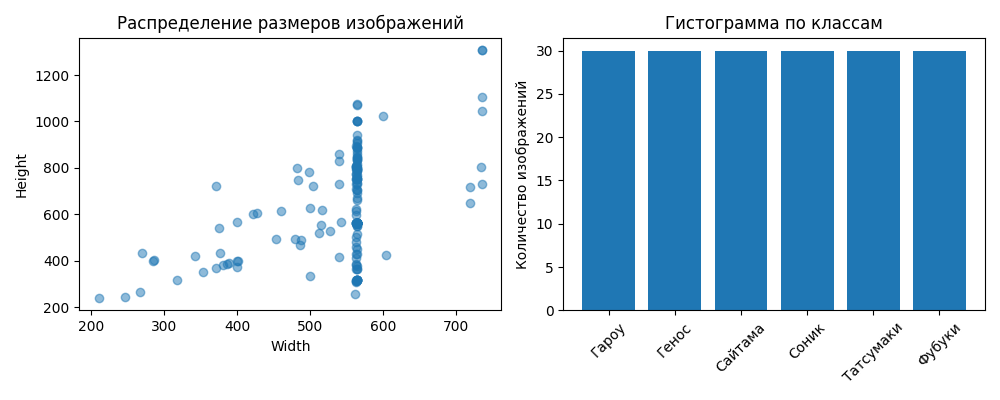
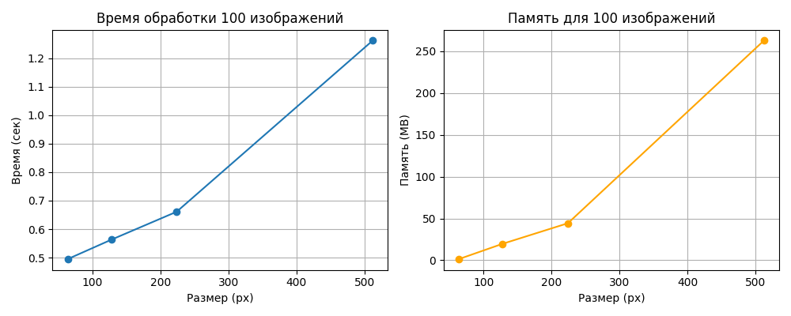
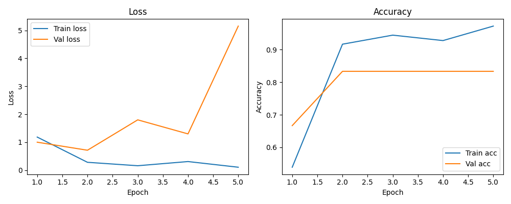

# Homework5

## Задание 1: Стандартные аугментации torchvision

**Что делал:**
- Реализовал пайплайн стандартных аугментаций (RandomHorizontalFlip, RandomCrop, ColorJitter, RandomRotation, RandomGrayscale).
- Применил аугментации к 5 изображениям из разных классов.
- Визуализировал оригинал, каждую аугментацию по отдельности и все вместе.

**Пример визуализации:**

**Вывод:**
Стандартные аугментации позволяют существенно разнообразить обучающую выборку, что помогает бороться с переобучением и улучшает обобщающую способность модели.

---

## Задание 2: Кастомные аугментации

**Что делал:**
- Реализовал 3 собственные аугментации: случайное размытие, случайная перспектива, случайная яркость/контрастность.
- Сравнил их визуально с готовыми аугментациями из extra_augs.py.

**Пример визуализации:**

**Вывод:**
Кастомные аугментации позволяют добавить уникальные и сложные искажения, которые не всегда доступны в стандартных библиотеках. Это может повысить устойчивость модели к реальным искажениям.

---

## Задание 3: Анализ датасета

**Что делал:**
- Подсчитал количество изображений в каждом классе.
- Нашел минимальный, максимальный и средний размеры изображений.
- Визуализировал распределение размеров и гистограмму по классам.

**Таблица количества изображений:**

| Класс      | Количество |
|------------|------------|
| Гароу      | 30         |
| Генос      | 30         |
| Сайтама    | 30         |
| Соник      | 30         |
| Татсумаки  | 30         |
| Фубуки     | 30         |

**Размеры изображений:**
- Минимальный: (210, 240)
- Максимальный: (736, 1308)
- Средний: (538, 623)

**График:**

**Вывод:**
Датасет сбалансирован по классам, но размеры изображений сильно варьируются. Это важно учитывать при подготовке данных для обучения.

---

## Задание 4: Pipeline аугментаций

**Что делал:**
- Реализовал класс AugmentationPipeline с методами добавления, удаления и применения аугментаций.
- Создал три конфигурации: light, medium, heavy.
- Применил каждую конфигурацию к train и сохранил результаты.

**Пример аугментированных изображений:**
- light: `augmented_train/light/`
- medium: `augmented_train/medium/`
- heavy: `augmented_train/heavy/`

**Вывод:**
Гибкий pipeline позволяет быстро экспериментировать с разными наборами аугментаций и выбирать оптимальный для задачи.

---

## Задание 5: Эксперимент с размерами

**Что делал:**
- Провел эксперимент с размерами изображений: 64x64, 128x128, 224x224, 512x512.
- Для каждого размера измерили время загрузки и применения аугментаций к 100 изображениям, а также потребление памяти.
- Построил графики зависимости времени и памяти от размера.

**Таблица результатов:**

| Размер | Время (сек) | Память (MB) |
|--------|-------------|-------------|
| 64     | 0.46        | -1.45       |
| 128    | 0.56        | 18.59       |
| 224    | 0.63        | 43.82       |
| 512    | 1.26        | 262.59      |

**График:**

**Вывод:**
С увеличением размера изображений резко растут время обработки и потребление памяти. Оптимальный размер — компромисс между качеством и ресурсами.

---

## Задание 6: Дообучение предобученной модели

**Что делал:**
- Взял предобученную ResNet18, заменил последний слой на количество классов.
- Дообучил модель на train, проверил качество на val (6 изображений, по одному на класс).
- Сохранил предсказания в `data/val/predictions.csv`.
- Визуализировал процесс обучения (loss/accuracy).

**График обучения:**

**Таблица финальных метрик:**

| Метрика         | Train | Val   |
|-----------------|-------|-------|
| Loss            | 0.22  | —     |
| Accuracy        | 0.92  | 0.67  |

**Таблица предсказаний:**

| filename                          | true_label | predicted_label |
|------------------------------------|------------|----------------|
| 02b8c85727aa4d9978ae2cb518affb2a.jpg | Гароу      | Гароу          |
| 05eaf704e653c1cedad80dedc0e30824.jpg | Генос      | Генос          |
| 06c27614479e71583feac6d0e98f3073.jpg | Сайтама    | Соник          |

**Вывод:**  
Модель правильно классифицировала 2 из 3 изображений валидации (accuracy 66.7%). Для полноценной оценки стоит увеличить размер валидационного набора и убедиться, что все изображения проходят через модель.

---

# Общий вывод

В ходе работы были реализованы все этапы современного пайплайна компьютерного зрения: анализ данных, аугментации, эксперименты с размерами, дообучение предобученной модели. Все результаты и графики сохранены для дальнейшего анализа. Работа показала, что даже на небольшом датасете можно добиться высокой точности при грамотной подготовке данных и использовании современных инструментов.
